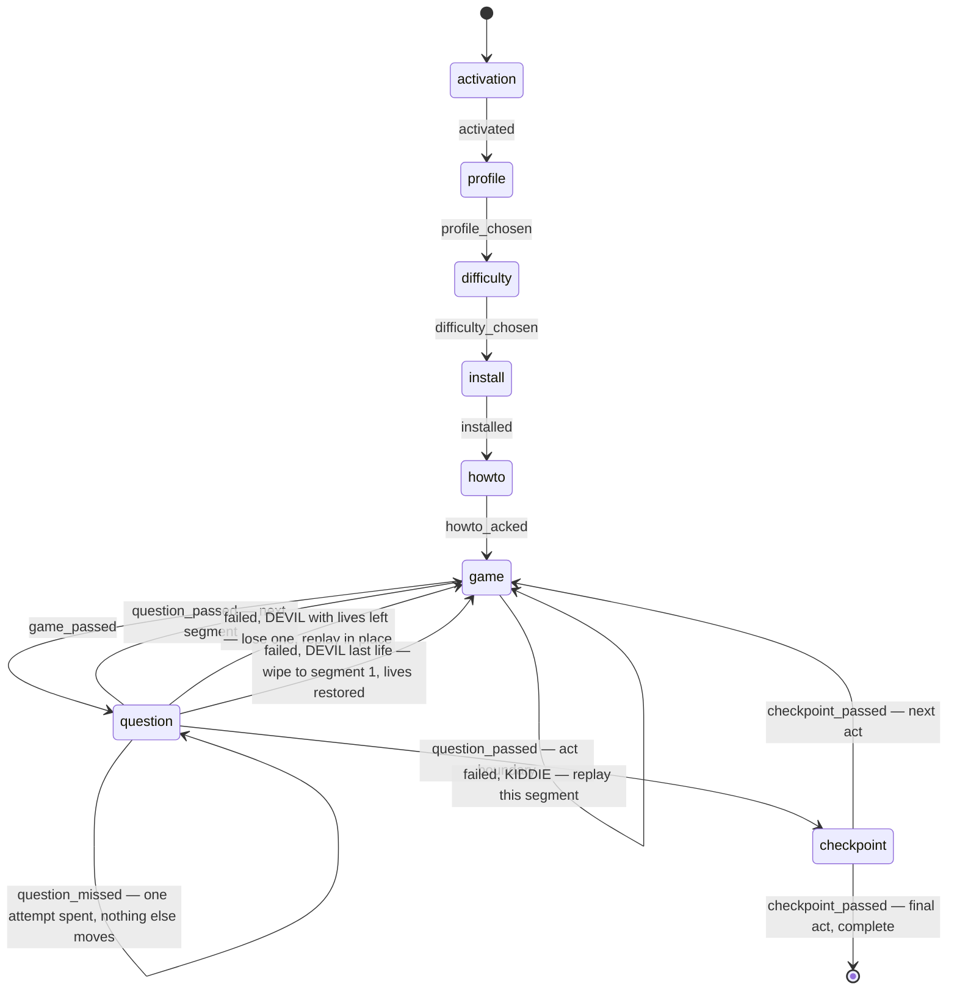
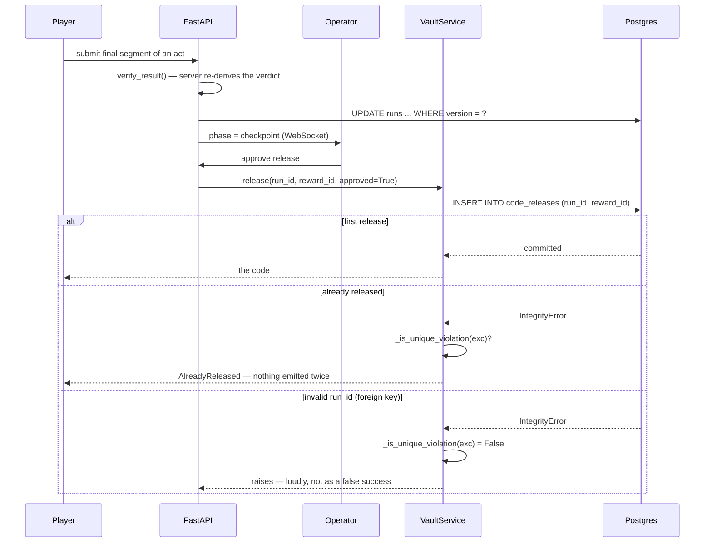

<div align="center">

# XXVI

**A one-shot, operator-gated state machine that releases irreversible payloads to an untrusted client.**

Eight segments · two people writing to one row · one evening, no second attempt

[](LICENSE)
[](server/pyproject.toml)
[](web/package.json)
[](server/xxvi/persistence/session.py)
[](server/tests)

</div>

---

## Table of Contents

- [What this is](#what-this-is)
- [What it does](#what-it-does)
- [Architecture](#architecture)
- [The run, as a state machine](#the-run-as-a-state-machine)
- [How a payload gets released](#how-a-payload-gets-released)
- [Architecture, and why](#architecture-and-why)
  - [Releasing a payload at most once](#releasing-a-payload-at-most-once)
  - [Mutating a run under two concurrent writers](#mutating-a-run-under-two-concurrent-writers)
  - [Deciding whether a minigame was actually won](#deciding-whether-a-minigame-was-actually-won)
  - [Running the tests twice, against two databases](#running-the-tests-twice-against-two-databases)
  - [Passing secrets to the container](#passing-secrets-to-the-container)
- [Repo structure](#repo-structure)
- [Quick start](#quick-start)
- [Make it yours](#make-it-yours)
- [Tech stack](#tech-stack)
- [What's imperfect](#whats-imperfect)
- [Security](#security)
- [Licence](#licence)

## What this is

XXVI was written for one evening. It ran live, once, as a birthday gift: a
console-styled web app where clearing a group of segments released a real
gift-card code, and the questions were ones only the recipient could answer.

That deadline is why the interesting parts are interesting. There was no
opportunity to patch and no second attempt. Releasing a code twice cost real
money; releasing zero codes while telling the player it had worked was worse,
and much harder to notice. The minigames deciding whether a release happened
at all ran in a browser I did not control. And two authenticated people — the
player working through the run, and an operator watching and intervening from
a second screen — wrote to the same database row at the same time.

So the evening became the spec. Everything below exists because something
about that night needed it.

This repository is that system with the person taken out: the recipient, the
questions, the trophies, the payloads and the number of acts all come from one
config file, and `docker compose up` plays a demo run with nothing to edit.

## What it does

- **Eight segments, each a minigame and a question.** Five mechanics ship —
  `simon`, `stack`, `drift`, `trophy_run`, `update` — and every one of them is
  re-verified on the server, because the browser's own verdict is not evidence.
- **An operator screen that watches the run live.** WebSocket updates, a
  checkpoint bypass, skip-game, and a reset that needs a typed confirmation
  rather than a boolean, because it deletes the record that a payload was
  handed over.
- **Two difficulty modes.** KIDDIE costs you the current segment on a failure;
  DEVIL gives three lives for the whole run, never refilled. Payloads already
  released are never revoked on either path.
- **A payload released at most once,** enforced by a database constraint
  rather than application logic — the one guarantee that survives a bug in my
  own code.
- **Content from one YAML file,** validated at load against a JSON Schema
  generated from the same models, so an editor gives completion and inline
  errors before anything boots.
- **A demo configuration checked in on purpose,** deliberately weak, which the
  preflight check refuses to run for real.

## Architecture

```mermaid
flowchart LR
    subgraph Player["🎮 Player browser"]
        Game["Minigame\nseeded, times itself"]
        Q["Question\nfree text"]
    end

    subgraph Op["🖥️ Operator browser"]
        Dash["Live dashboard\napprove · bypass · reset"]
    end

    subgraph API["⚙️ FastAPI"]
        Verify["games/verify.py\nre-derives the verdict"]
        Machine["core/machine.py\npure state machine"]
        Vault["vault/service.py\nat-most-once release"]
        Hub["realtime/hub.py\nin-memory, single process"]
    end

    subgraph DB[("🐘 Postgres")]
        Runs[("runs\nversion = CAS token")]
        Ledger[("code_releases\nUNIQUE run_id, reward_id")]
        Tokens[("consumed_tokens\nUNIQUE run_id, nonce")]
    end

    Game -- "signed segment token\n+ claimed result" --> Verify
    Q --> Machine
    Verify -- "verdict the server derived" --> Machine
    Machine -- "UPDATE ... WHERE version = ?" --> Runs
    Verify -- "single-use check" --> Tokens
    Dash -- "approve release" --> Vault
    Vault -- "INSERT first, catch the violation" --> Ledger
    Machine --> Hub --> Dash
```

The decision the whole thing rests on: **the database, not the application,
holds the guarantees that matter.** Four unique constraints do real
concurrency control, and they live in the Alembic migrations rather than only
in the models — so they hold in the deployed database no matter what the
Python does.

## The run, as a state machine

`core/machine.py` imports exactly one module — its own dataclasses. No I/O, no
config, no database. Difficulty rules and attempt limits are threaded in as
parameters by the layer above, never read from config inside `core/`.



Two details in there are load-bearing. `question_missed` is a separate event
from `question_failed` precisely so a typo cannot reach the expensive
consequences — spending a life, clearing trophies, replaying the game — which
hang off the terminal event alone. And a DEVIL wipe restores lives to full,
because otherwise the second attempt is unwinnable.

## How a payload gets released



That third branch is the point of the whole design, and the next section is
about why.

## Architecture, and why

Five decisions, each with the obvious approach, what I chose instead, and what
it cost.

### Releasing a payload at most once

The obvious approach is to check whether a code has already been released,
then insert a record and emit it. That is a race: two requests can both read
"not released" before either writes.

I inserted first and let the database reject the duplicate. The claim is
written to `code_releases` before anything is emitted, and
`UNIQUE(run_id, reward_id)` is the concurrency primitive — not application
logic, not a lock.

```python
async with self._sessionmaker() as session:
    session.add(CodeRelease(run_id=run_id, reward_id=reward_id))
    try:
        await session.commit()
    except IntegrityError as exc:
        await session.rollback()
        if not _is_unique_violation(exc):
            raise
        raise AlreadyReleased(f"reward {reward_id} already released") from None
```

The `if not _is_unique_violation(exc): raise` is what makes this safe rather
than merely compact, and the reasoning is carried in that function's
docstring. It is reproduced here in full rather than summarised:

```
Distinguish "duplicate (run_id, reward_id)" from any other IntegrityError.

`CodeRelease.run_id` is itself a foreign key to `runs.id`, so an invalid
run id raises an `IntegrityError` too -- as would any other constraint
violation the schema grows later. A bare `except IntegrityError` would
misread all of those as "already released" and swallow them as a quiet
success-shaped no-op, which is catastrophic here (no code gets emitted
and nobody is told why). Only the specific unique-constraint violation
on `(run_id, reward_id)` may be treated as a duplicate; everything else
must propagate as a real error.

Two checks, for two different reasons -- read this before "simplifying"
either one away:

- `type(orig).__name__ == "UniqueViolationError"`: this is here for
  asyncpg, which raises a `UniqueViolationError` distinct from
  `ForeignKeyViolationError` in its own exception hierarchy. In
  practice this branch does NOT fire against this project's stack:
  SQLAlchemy's asyncpg dialect re-wraps the driver-level error before
  it reaches `exc.orig`, so as currently observed this is dead code in
  production. It is kept in case that wrapping behaviour ever changes
  upstream, but nothing here currently depends on it firing.
- The message-substring match (`"unique constraint" in message`) is
  NOT a fallback -- it is what actually distinguishes the two cases on
  both backends this project uses today (Postgres via asyncpg in
  production, SQLite via aiosqlite in tests), because both wrap the
  real error down to a message-only `IntegrityError` by the time it's
  inspectable here. Deleting it as "redundant" with the branch above
  would silently turn every IntegrityError back into a false
  "already released" -- i.e. it would reintroduce the exact bug this
  function exists to fix.

Residual risk NOT closed by this function: a primary-key unique
violation -- e.g. from an `id` sequence desync after a database
dump/restore -- would also contain "unique constraint" in its message
and would be misread as AlreadyReleased, the same way a bare
`except IntegrityError` would misread an FK violation. This is a much
narrower window (a specific kind of database corruption vs. any
IntegrityError) but it is not eliminated here.
```

— `server/xxvi/vault/service.py::_is_unique_violation`

The same idiom, against the same kind of constraint, carries
`consumed_tokens` (`UNIQUE(run_id, nonce)`, single-use segment tokens) and
`trophies_earned` (`UNIQUE(run_id, trophy_id)`).

**What it cost.** Anything shown to a client reads the `code_releases` ledger,
never the field named `released_rewards` on the run row. That field is the
state machine's own record of which checkpoints have been cleared, set the
instant a checkpoint passes — before the operator has approved anything. The
two disagree legitimately, and every future reader has to know which one is
authoritative. I accepted a permanent second source of truth over a UI that
says "released" about a code that does not exist
(`server/xxvi/api/run_service.py::released_reward_ids`).

### Mutating a run under two concurrent writers

The obvious approach is to load the run, mutate it, and save. Two concurrent
events then compute two whole new states from the same read, and whichever
writes second overwrites fields the first had already changed.

I made every mutation a compare-and-swap against the version the caller read,
setting all mutable columns in one statement:

```python
update(Run)
  .where(Run.id == run_id, Run.version == expected_version)
  .values(phase=..., segment=..., cleared_segments=..., lives=...,
          version=expected_version + 1)
# rowcount == 1 if this write landed, 0 if it lost the race and must retry
```

— `server/xxvi/persistence/repositories.py::save_state`

Two different failures are prevented, and the tests name them separately. A
torn row is two events each writing a full state computed from the same read
(`test_concurrent_divergent_events_never_produce_a_torn_row`). A lost update
is milder: two concurrent failures in DEVIL both read `lives=3` and both write
`lives=2`, where the correct outcome is 3 → 2 → 1 across the two events with
the loser retrying
(`test_two_concurrent_devil_failures_cost_two_lives_not_one`).

**What it cost.** The guarantee depends on a discipline the type system does
not enforce: `expected_version` must be the version the caller read the state
from. Passing a re-read, or a value from a different request, compiles, runs,
and silently defeats it. The docstring says so; nothing else stops it. Deletes
are also ordered explicitly by foreign key, because this schema does not use
`ON DELETE CASCADE`.

### Deciding whether a minigame was actually won

The obvious approach is to trust the client's own verdict, since it ran the
game. The client sends one — `passed_client_side` — and the server never reads
it as authority. The verdict is re-derived from the segment's seed, the
claimed input count, and a wall-clock cross-check against the segment token's
signed issue time (`server/xxvi/games/verify.py::verify_result`).

Two decisions inside that file went against the obvious direction.

**I removed a check because it punished skill.** A per-input rate floor
(`MIN_MS_PER_INPUT`, 60ms) applies to mechanics where each input is a discrete
answer. It originally applied to `drift` as well — continuous steering, where
the correct way to play is a rapid stream of taps, easily several hundred over
a twenty-second segment. The effect was that the better someone played, the
more likely the server rejected them: fill the meter early, submit, be told
you failed. Three such rejections also awarded a hidden trophy, so the run
congratulated the player for a bug. `drift` is now exempt through a named
constant, `RATE_FLOOR_EXEMPT`, and keeps the checks that model it — time in
zone, duration, and the wall-clock cap.

**An earlier hardening turned out to be dead code, and the docstring works out
why.** I had added a lower bound phrased in terms of the client-claimed
`duration_ms`. Given `duration_ms >= input_count * MIN_MS_PER_INPUT` and
`duration_ms <= elapsed_ms + slack`, that added condition is already implied
and can never fire. I rephrased the bound against server-measured
`elapsed_ms`, which an attacker cannot shorten, and dropped the client-claimed
version for that path.

**What it cost.** Real coverage, stated rather than implied. From the same
docstring:

> This narrows, but does not eliminate, the attack it targets:
> `MAX_CLOCK_SLACK_MS` (2000ms) still exceeds the natural per-input floor for
> most configured segments (e.g. a 4-length Simon sequence floors at 240ms),
> so an instantly-solved low-floor segment submitted immediately still slips
> under this bound.

Tightening the slack starts rejecting honest players on slow connections. The
gap is bounded, quantified, and left open.

### Running the tests twice, against two databases

The obvious approach is one suite against one database. The fast suite runs
561 tests against SQLite in memory in about 35 seconds, which is what makes it
usable while working.

I split out a second suite that runs only against real Postgres, because the
fast one cannot prove what it appeared to prove. From
`server/tests/integration/README.md`:

> SQLite's `StaticPool` fixture used everywhere in `tests/conftest.py`
> secretly serializes every session in a test through one shared connection,
> which makes any conclusion drawn from it about *concurrent* access unsound.
> Three separate Criticals on this project were concurrency races that SQLite
> structurally cannot detect, and one shared fixture was found to produce a
> confidently wrong result on the money path: an 8-way race reported "1
> success, 7 conflicts" — exactly the expected pass condition — while leaving
> no row in the database at all.

The Postgres tier covers real concurrent connections against real MVCC
(`test_16_way_concurrent_release_emits_exactly_one_code_and_one_row`,
`test_13_concurrent_wrong_guesses_lock_at_exactly_attempts_3_not_fewer`,
`test_30_concurrent_wrong_attempts_at_activation_never_hard_locks`), runs the
actual Alembic migrations including a downgrade-and-upgrade round trip — the
fast suite builds its schema from `Base.metadata.create_all()` and never runs
a migration — and pins the places SQLite's emulation diverges (`timestamptz`
awareness on read, `UPDATE ... RETURNING` with zero matched rows).

**What it cost.** Two suites to maintain, and the tier that proves the most is
the one that does not run in CI. A default `pytest` reports
`561 passed, 13 skipped`, and those 13 skipped are the tests guarding the
release path. Anyone reading a green run without knowing that is reading less
than they think.

### Passing secrets to the container

The obvious approach is `env_file: .env` in Compose. That broke every login
with a 401.

Compose interpolates `$` in env-file values, and an argon2 hash is literally
`$argon2id$v=19$m=65536,...` — so `$argon2id`, `$v` and `$m` expanded to empty
strings and the container received a mangled hash. Escaping them as `$$` fixes
Compose and breaks the command-line tools, which read the same file directly
through Pydantic. I mounted the file instead and let the application parse it,
so one file has one literal meaning (`docker-compose.yml`, the `api` service).

**What it cost.** The standard mechanism, and a container that now depends on
a mounted host path rather than being configured by its environment.

## Repo structure

```text
xxvi/
├── server/                       FastAPI service, state machine, vault
│   ├── xxvi/
│   │   ├── core/                  pure state machine — imports nothing but its own models
│   │   ├── games/                 verify.py (server-authoritative), tokens.py, seeds.py
│   │   ├── vault/                 at-most-once payload release
│   │   ├── gates/                 activation + checkpoint codes, lockout policy
│   │   ├── persistence/           models, repositories (CAS), engine/pooling
│   │   ├── realtime/              in-memory WebSocket hub
│   │   ├── api/                   routes, dependencies, run service
│   │   ├── content/               YAML schema + loader
│   │   └── cli.py                 check-config, validate-config, hash-secret, release
│   ├── tests/                     561 fast tests (SQLite in memory)
│   │   └── integration/           13 Postgres-only tests — see its own README
│   └── alembic/versions/          0001–0005
│
├── web/
│   └── src/
│       ├── games/                 the five mechanics + GameHost
│       ├── shell/                 console screens (activation, profile, checkpoint, reveal…)
│       ├── lib/                   three-bus WebAudio mix, API client
│       └── api.ts                 generated from the server's OpenAPI schema
│
├── config/
│   ├── run.example.yaml           the playable demo config
│   └── run.schema.json            generated from the Pydantic models
│
├── deploy/                        production compose + Caddyfile, behind an existing proxy
├── docs/                          design system, runbook
├── tools/                         audio prep, narration generation
└── .env.demo                      complete, deliberately weak, checked in on purpose
```

## Quick start

```bash
git clone https://github.com/kritish08/xxvi.git && cd xxvi
cp .env.demo .env

docker compose up -d db                            # database first
docker compose run --rm api alembic upgrade head   # then the schema
docker compose up -d --build                       # then everything else
```

Then <http://localhost>:

| | |
|---|---|
| Player | `player` / `demo` |
| Operator | `operator` / `demo` |
| Product key | `DEMO-1234-5678` |
| Checkpoint code | `DEMO` (both acts) |

**The ordering is not cosmetic.** The API queries the `accounts` table during
startup, so starting it against an unmigrated database produces a crash loop
on `sqlalchemy.exc.ProgrammingError: relation "accounts" does not exist`,
which reads like a broken image rather than a missing step.

`.env.demo` is a complete, deliberately weak configuration, checked in on
purpose. It cannot be used for a real run by accident:
`python -m xxvi.cli check-config` refuses to pass with its values in place and
names each offender. It serves plain HTTP — over HTTPS, Caddy issues a
certificate from its own internal CA and the first screen is a browser
security warning.

## Make it yours

Everything the run says and does lives in `config/run.yaml` (gitignored; the
server falls back to `config/run.example.yaml` and says so in its logs).

```yaml
recipient: "you"
operator: "the operator"        # shown on the profile tile and in checkpoint copy
title: "XXVI"
strapline: "you've been playing this one for years."
acts: 2
segments_per_act: 4

questions:
  - prompt: "Which game did we fight over?"
    accept: ["GTA IV", "GTA 4"]   # normalised: case, spacing and punctuation ignored
    blank: "___ __"
    roast: "Twenty years, and that one is gone."

games:
  - { segment: 1, mechanic: simon, params: { length: 4 } }

rewards:
  - { id: 1, after_act: 1, label: "₹1,000 PlayStation Network" }
```

- The first line of the file points at `run.schema.json`, so an editor gives
  completion and inline errors as you type.
- `python -m xxvi.cli validate-config <path>` prints one line per problem
  instead of a traceback.
- A test (`test_the_committed_schema_is_in_sync_with_the_model`) asserts the
  committed schema equals what the models generate, so CI fails if the two
  have drifted.
- Reward labels are capped at 32 characters — measured against the reveal
  screen, which renders them at up to 144px with no truncation.
- `acts` is not fixed at two. Each act gets its own gate
  (`checkpoint_{n}`) and its own `REWARD_{n}_CODE`.

## Tech stack

| Layer | Choice |
|---|---|
| API | Python 3.12, FastAPI, Pydantic v2 |
| Persistence | SQLAlchemy 2 (async), Alembic, Postgres via asyncpg |
| Concurrency | Optimistic CAS on a version column; four `UNIQUE` constraints as the real primitives |
| Client | React 19, TypeScript, Vite |
| Client types | Generated from the server's OpenAPI schema via `openapi-typescript` |
| Audio | WebAudio — three buses (music/SFX/voice), crossfaded loops, compressor as limiter |
| Tests | pytest (561, SQLite) + a separate Postgres tier (13); Vitest (188) |
| Serving | Caddy, Docker Compose |
| Diagrams | Mermaid (this README) |

Roughly 4,600 lines of server code against 7,800 lines of server tests, and
8,000 lines of client code against 3,600 lines of client tests.

## What's imperfect

- **The WebSocket hub is in-memory and single-process** by design
  (`server/xxvi/realtime/hub.py`). Fan-out does not cross replicas, so this is
  where the system fails first under horizontal scaling. It was built for one
  player and one operator and was never asked to do more.
- **The operator's force-go-live flag is in-memory too** and does not survive
  a restart (`server/xxvi/main.py`). Adding a migration for a flag used once,
  on one evening, was the wrong trade that close to the date. It is documented
  in `docs/runbook.md` rather than fixed.
- **The verification gap above is open.** An instantly-solved low-floor segment
  submitted immediately still passes the wall-clock check. Closing it means
  rejecting honest players on slow connections.
- **`_is_unique_violation` has a residual risk.** A primary-key collision from
  an id-sequence desync after a dump and restore would be misread as
  `AlreadyReleased`, the same way a bare `except IntegrityError` misreads a
  foreign-key violation. Narrower, not eliminated.
- **One branch of `_is_unique_violation` is dead code in production** and is
  documented as such. SQLAlchemy's asyncpg dialect re-wraps the driver error
  before it reaches `exc.orig`, so the type-name check never fires. It is kept
  against that wrapping changing upstream.
- **The 13 Postgres tests do not run in CI.** They need `PG_TEST_URL` pointing
  at a real database, so CI proves the fast suite only.
- **The operator dashboard still hardcodes two checkpoints.** A three-act run
  works, but clearing an act-3 lockout needs the CLI rather than the dashboard.
- **A web configuration editor was cut.** It would have been the largest
  subsystem here and carried its own authorisation surface, for content edited
  a handful of times.
- **There is no plugin interface for new minigame mechanics.** The five that
  exist are the five that ran.
- **Narration is generated and disabled.** Two full text-to-speech passes were
  produced and I judged both wrong for the interface, not merely low quality.
  Every narrated line has an on-screen equivalent, so nothing is lost with it
  off (`web/public/audio/PROVENANCE.md`).
- **No screenshots yet.** When added they will come from the demo
  configuration, since the real content names an identifiable third party.
- **Frontend rendering is unmeasured.** The audio gain chain was measured
  (roughly −41 LUFS at output before correction, against a −26 target) and a
  5.5-second startup delay was measured and fixed, but no profiling of React
  render cost or bundle parse time was done.

## Security

Real content and real secrets live in `config/run.yaml` and `.env`, both
gitignored and never committed. `.env.example` shows the shape each expects;
`.env.demo` is a working set of deliberately weak values that
`python -m xxvi.cli check-config` refuses for a real run.

Gate secrets are stored as argon2 hashes — there is no plaintext field
anywhere in `Settings`. Checkpoint gates lock after three failed attempts; the
activation gate deliberately never hard-locks, because bricking the front door
with no operator bypass is a worse failure on a single-evening run than a
brute-forceable one. Question answers live only in the server's config and are
never serialised to the client, which a test pins rather than a convention
(`server/tests/test_content_leak.py`).

If you fork this, generate your own secrets. Do not reuse anything that has
ever appeared in this repository's history.

## Licence

[MIT](LICENSE) — Copyright (c) 2026 Kritish.

The four music tracks under `web/public/audio/music/` are generated output I
produced, redistributed under the same licence; provenance for every audio
asset is in `web/public/audio/PROVENANCE.md`. Archivo and IBM Plex are under
the SIL Open Font License 1.1, confirmed against
[IBM/plex](https://github.com/IBM/plex/blob/master/LICENSE.txt) and
[google/fonts](https://github.com/google/fonts/blob/main/ofl/archivo/OFL.txt).

---

<div align="center">

*Built for one evening. Written so it could survive one.*

</div>
